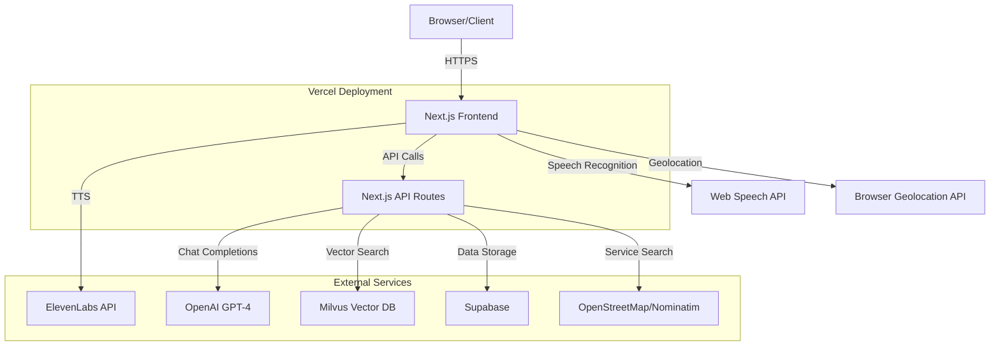
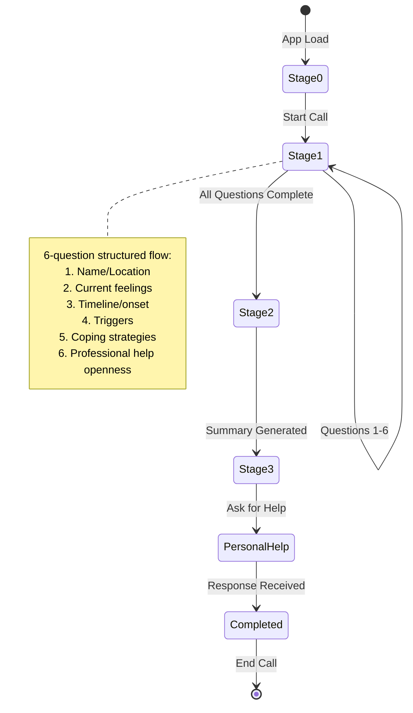
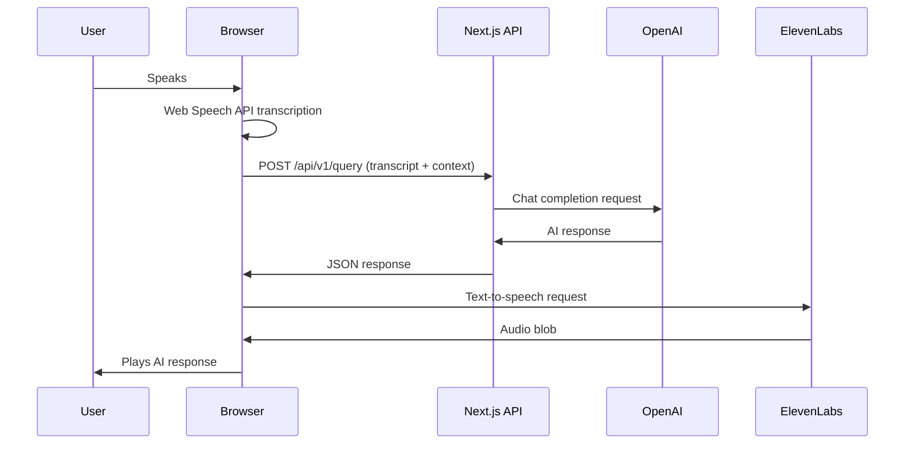
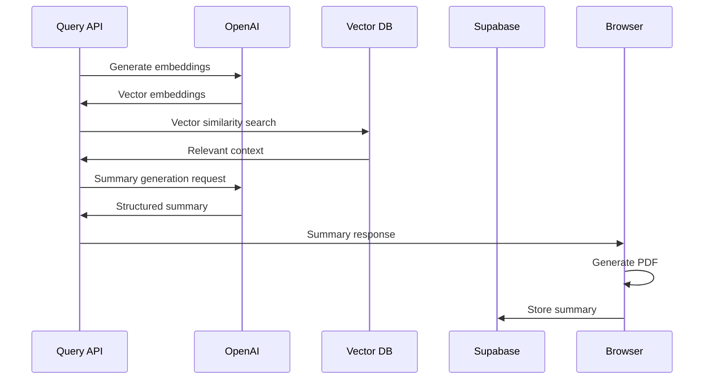

# First-Voice.AI Architecture Documentation

## Architecture at a Glance

### System Overview


### Data Flow & Classification

| Data Type | Classification | Storage Location | Transit Encryption |
|-----------|----------------|------------------|-------------------|
| Voice Audio | **PII** | Browser only (not stored) | N/A (local processing) |
| Conversation Transcripts | **PII** | Supabase (PDF Summary table) | HTTPS/TLS |
| User Location | **PII** | Temporary (browser session) | HTTPS/TLS |
| Generated Summaries | **PII** | Supabase + PDF download | HTTPS/TLS |
| API Keys | **Sensitive** | Environment variables | Encrypted at rest |
| Session State | **Non-PII** | Browser memory | N/A |

## Infrastructure & Runtime

### Hosting & Deployment
- **Primary**: Vercel (serverless functions + static hosting)
- **Database**: Supabase (PostgreSQL)
- **Vector DB**: Milvus (cloud-hosted)
- **CDN**: Vercel Edge Network

### Server Entry Points
```
my-app/app/api/
├── route.js                    # Legacy Milvus vector search endpoint
└── v1/
    ├── query/route.js          # Main conversation handler
    ├── doctorRecommendations/route.js  # AI-generated provider recommendations
    ├── searchServices/route.js # Location-based mental health services
    └── resources/route.js      # Mental health resource compilation
```

### Build Configuration
- **Framework**: Next.js 15.2.4 (App Router)
- **Build Command**: `next build`
- **Output**: Static + Serverless functions
- **Environment**: Node.js runtime on Vercel

### Environment Variables

| Variable | Purpose | Example | Referenced In |
|----------|---------|---------|---------------|
| `OPENAI_KEY` | OpenAI API access | `sk-...` | `/api/v1/query/route.js:10` |
| `OPENAI_API_KEY` | Alternative OpenAI key | `sk-...` | `/api/v1/resources/route.js:8` |
| `NEXT_PUBLIC_ELEVEN_LABS_API_KEY` | Text-to-speech | `el_...` | `/components/speaker.js:22` |
| `NEXT_PUBLIC_SUPABASE_URL` | Supabase endpoint | `https://...` | `/lib/supabase.js:3` |
| `NEXT_PUBLIC_SUPABASE_ANON_KEY` | Supabase public key | `eyJ...` | `/lib/supabase.js:4` |
| `MILVUS_URL` | Vector DB endpoint | `https://...` | `/api/route.js:8` |
| `MILVUS_KEY` | Vector DB auth token | `db_...` | `/api/route.js:9` |

### Supabase Configuration
- **Auth**: Anonymous access (no user registration required)
- **Tables**: 
  - `PDF Summary` - stores conversation summaries and generated PDFs
- **RLS**: Not implemented (relies on anonymous access)
- **Connection**: Client-side via `@supabase/supabase-js`

### External API Integrations

#### OpenAI Integration
- **Models**: `gpt-4o-mini` (primary), `gpt-4o` (doctor recommendations)
- **Usage**: Chat completions, embeddings (`text-embedding-ada-002`)
- **Rate Limiting**: Handled by OpenAI (no client-side limits)
- **Error Handling**: Try-catch with fallback responses

#### ElevenLabs TTS
- **Voice**: Emily (`EXAVITQu4vr4xnSDxMaL`)
- **Model**: `eleven_turbo_v2` (Eleven Flash 2.5)
- **Settings**: Stability 0.7, Similarity boost 0.7
- **Implementation**: `/components/speaker.js:86-129`

#### Web Speech API (STT)
- **Browser Support**: WebKit Speech Recognition
- **Configuration**: Continuous listening, interim results
- **Implementation**: `react-speech-recognition` library
- **Echo Prevention**: AI message detection in `/app/page.js:258-294`

## Codebase Map

```
First-Voice.AI/
├── my-app/                     # Next.js application
│   ├── app/
│   │   ├── api/                # Server-side API routes
│   │   │   ├── route.js        # Vector search (legacy)
│   │   │   └── v1/             # Current API version
│   │   │       ├── query/      # Main conversation handler
│   │   │       ├── doctorRecommendations/  # Provider suggestions
│   │   │       ├── searchServices/         # Location-based services
│   │   │       └── resources/              # Mental health resources
│   │   ├── components/         # React UI components
│   │   │   ├── NavBar.jsx      # Navigation with smooth scroll
│   │   │   ├── Modal.jsx       # Settings modal overlay
│   │   │   ├── Footer.jsx      # Page footer
│   │   │   └── Geolocation.jsx # Location permission handler
│   │   ├── page.js             # Main application (2400 lines)
│   │   ├── layout.js           # Root layout with fonts
│   │   └── globals.css         # Tailwind CSS styles
│   ├── components/             # Shared components
│   │   ├── speaker.js          # ElevenLabs TTS integration
│   │   ├── microphone.js       # Legacy STT component (unused)
│   │   └── Modal.js            # Duplicate modal component
│   ├── lib/
│   │   └── supabase.js         # Supabase client configuration
│   └── package.json            # Dependencies and scripts
├── docs/                       # Documentation (created)
│   └── ARCHITECTURE.md         # This file
└── vercel.json                 # Vercel deployment config
```

### Key Modules

#### Conversation Engine (`/app/page.js`)
- **Primary State Manager**: 40+ useState hooks managing conversation flow
- **Speech Integration**: Web Speech API + ElevenLabs TTS
- **PDF Generation**: Client-side with `pdf-lib`
- **Geolocation**: Browser API integration

#### API Controllers (`/app/api/v1/`)
- **Query Handler**: 6-stage conversation flow with OpenAI
- **Doctor Recommendations**: GPT-4 powered provider matching
- **Service Search**: Location-based mental health service discovery
- **Resource Compilation**: Curated mental health resources

#### UI Components
- **NavBar**: Animated navigation with smooth scrolling
- **Speaker**: TTS playback with queue management
- **Modal**: Settings overlay with backdrop blur
- **Geolocation**: Silent location permission handler

## Conversation Engine & State Handling

### State Machine Pattern

The application implements a **stage-based conversation flow** with the following states:



### State Transitions & Guards

#### Stage 1: Question Flow (`/app/api/v1/query/route.js:109-190`)
```javascript
// State: currentQuestion (1-6), answerSufficient (boolean)
// Transition: Advance if answer sufficient, repeat if not
// Guard: Max 3 repetitions before forced advance

if (isAnswerSufficient && currentQuestion < 6) {
    nextQuestionNumber = currentQuestion + 1;
}
```

#### Stage 2: Summary Generation (`/app/api/v1/query/route.js:192-299`)
```javascript
// Trigger: After question 6 completion
// Process: Vector search + GPT summarization
// Output: Structured triage assessment
```

#### Stage 3: Personal Help Question (`/app/api/v1/query/route.js:301-384`)
```javascript
// Dynamic question generation based on conversation context
// Personalized with user name and location if available
```

### Side Effects

1. **TTS Queue Management**: Automatic speech synthesis with echo prevention
2. **PDF Generation**: Client-side summary creation with local resources
3. **Location Services**: Optional geolocation for service recommendations
4. **Supabase Storage**: Conversation summaries stored for reference

## End-to-End Request Pipelines

### Voice Interaction Loop



### Storage & Summary Pipeline



### Error Handling Patterns

#### Timeout Handling
- **Speech Recognition**: 300ms delay after TTS stops
- **Geolocation**: 10-second timeout with fallback
- **API Calls**: Try-catch with user-friendly error messages

#### Partial Failures
- **TTS Unavailable**: Conversation continues without audio
- **Location Denied**: PDF generated without local services
- **OpenAI Errors**: Fallback to generic responses

#### Echo Prevention (`/app/page.js:258-294`)
```javascript
const isLikelyAIEcho = (transcript) => {
    // Compare with recent AI messages
    // Check for 3+ consecutive word matches
    // Ignore if significant overlap detected
};
```

## Security & Privacy

### Authentication Flow
- **Model**: Anonymous access (no user accounts)
- **Session**: Browser-based state management
- **API Security**: Environment variable-based API keys
- **CORS**: Default Next.js CORS handling

### PII Handling
- **Voice Data**: Never leaves browser, processed locally
- **Transcripts**: Temporarily stored, included in PDF summaries
- **Location**: Coordinates only, not stored permanently
- **Conversations**: Stored in Supabase for PDF generation

### Data Minimization
- **No User Profiles**: Anonymous sessions only
- **Minimal Retention**: Data stored only for PDF generation
- **Client-Side Processing**: Audio processing in browser
- **Secure Transmission**: HTTPS for all external communications

### Content Safety
- **Prompt Engineering**: Professional, empathetic responses
- **Crisis Detection**: Identifies suicidal ideation keywords
- **Resource Provision**: Always includes crisis hotlines
- **Professional Boundaries**: Disclaimers about not replacing professional help

### Secrets Management
- **Environment Variables**: Vercel environment configuration
- **Client-Side Keys**: `NEXT_PUBLIC_` prefix for browser access
- **Server-Side Keys**: Secure server environment only
- **No Hardcoded Secrets**: All sensitive data externalized

## Local Development & Production

### Development Setup

```bash
# Clone repository
git clone https://github.com/ronitbatra/First-Voice.AI.git
cd First-Voice.AI/my-app

# Install dependencies
npm install

# Environment setup (create .env.local)
OPENAI_KEY=sk-your-openai-key
NEXT_PUBLIC_ELEVEN_LABS_API_KEY=your-elevenlabs-key
NEXT_PUBLIC_SUPABASE_URL=your-supabase-url
NEXT_PUBLIC_SUPABASE_ANON_KEY=your-supabase-key
MILVUS_URL=your-milvus-endpoint
MILVUS_KEY=your-milvus-token

# Start development server
npm run dev
```

### Environment Template (.env.local.example)
```bash
# OpenAI Configuration
OPENAI_KEY=sk-your-openai-api-key-here
OPENAI_API_KEY=sk-your-openai-api-key-here

# ElevenLabs TTS
NEXT_PUBLIC_ELEVEN_LABS_API_KEY=your-elevenlabs-api-key

# Supabase Database
NEXT_PUBLIC_SUPABASE_URL=https://your-project.supabase.co
NEXT_PUBLIC_SUPABASE_ANON_KEY=your-supabase-anon-key

# Milvus Vector Database
MILVUS_URL=https://your-milvus-endpoint
MILVUS_KEY=your-milvus-api-key
```

### Testing & Quality Assurance
- **Linting**: ESLint with Next.js configuration
- **Type Safety**: JSDoc comments, no TypeScript
- **Manual Testing**: Browser-based conversation testing
- **No Automated Tests**: Currently no test suite implemented

### Production Deployment

#### Vercel Deployment
```bash
# Build for production
npm run build

# Deploy to Vercel
vercel --prod

# Environment variables set via Vercel dashboard
# Build configuration in vercel.json
```

#### Build Outputs
- **Static Assets**: CSS, images, fonts
- **Serverless Functions**: API routes as Lambda functions
- **Client Bundle**: React application with hydration
- **Service Worker**: None implemented

#### Required Environment Variables (Production)
- All development variables must be configured in Vercel dashboard
- `NEXT_DISABLE_ESLINT=1` set in vercel.json for faster builds

## Interview Cheat Sheet

### Technical Architecture (6 bullets)
- **Full-Stack Next.js**: React frontend with serverless API routes, deployed on Vercel with edge functions
- **AI-Powered Conversations**: OpenAI GPT-4 with 6-stage structured mental health assessment flow
- **Voice Interface**: Web Speech API for STT + ElevenLabs for natural TTS with echo prevention
- **Vector-Enhanced Context**: Milvus vector database for semantic search of mental health resources
- **Real-Time State Management**: 40+ React hooks managing conversation flow, PDF generation, and location services
- **Privacy-First Design**: Anonymous sessions, client-side audio processing, minimal data retention

### Technology Choices & Trade-offs (4 bullets)
- **Why Next.js/React**: Rapid development, serverless scaling, built-in API routes eliminate separate backend
- **Why OpenAI over alternatives**: Superior conversational AI for mental health context, established safety guidelines
- **Why ElevenLabs TTS**: Natural voice quality crucial for mental health conversations, better than browser TTS
- **Trade-off**: Client-side PDF generation increases bundle size but ensures privacy and offline capability

### Privacy & Scaling Considerations (2 bullets)
- **Privacy Posture**: Voice data never leaves browser, anonymous sessions, PII minimization with secure API key management
- **Next Steps**: Add streaming responses, implement retry/backoff patterns, structured logging, and performance monitoring

## Known Gaps & Quick Wins

### High-Priority Improvements

1. **Row Level Security (RLS)**
   - **Gap**: Supabase tables lack access controls
   - **Fix**: Implement RLS policies for PDF Summary table
   - **Impact**: Prevent unauthorized data access

2. **Token Budget Management**
   - **Gap**: No OpenAI token usage tracking or limits
   - **Fix**: Implement conversation length limits and token counting
   - **Impact**: Prevent API cost overruns

3. **Streaming TTS Response**
   - **Gap**: Audio generation blocks conversation flow
   - **Fix**: Implement streaming audio with progressive playback
   - **Impact**: Improved user experience and responsiveness

4. **Retry/Backoff Logic**
   - **Gap**: API failures result in hard errors
   - **Fix**: Exponential backoff for OpenAI, ElevenLabs calls
   - **Impact**: Better reliability and user experience

5. **Structured Logging**
   - **Gap**: Console.log statements throughout codebase
   - **Fix**: Implement structured logging with log levels
   - **Impact**: Better debugging and monitoring

### Medium-Priority Enhancements

6. **Performance Monitoring**
   - **Gap**: No P99 latency or error rate tracking
   - **Fix**: Add Vercel Analytics or custom monitoring
   - **Impact**: Proactive performance optimization

7. **Content Moderation**
   - **Gap**: No explicit content filtering beyond OpenAI defaults
   - **Fix**: Implement additional safety checks for crisis situations
   - **Impact**: Enhanced user safety

8. **Database Migrations**
   - **Gap**: No version control for Supabase schema changes
   - **Fix**: Implement migration scripts and schema versioning
   - **Impact**: Safer database deployments

### Technical Debt

- **Duplicate Components**: Modal.js exists in two locations
- **Legacy API Route**: `/api/route.js` appears unused but contains Milvus logic
- **Mixed API Key Names**: Both `OPENAI_KEY` and `OPENAI_API_KEY` used
- **Large Component**: Main page.js is 2400 lines, needs decomposition
- **Missing TypeScript**: Would improve development experience and reduce runtime errors

---

*Generated through comprehensive codebase analysis on Sunday, September 21, 2025*
