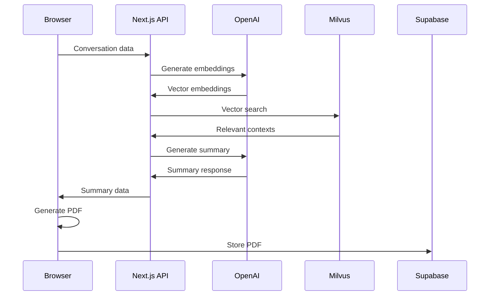

# Database Schema Documentation

## Overview

First-Voice.AI uses **Supabase** (PostgreSQL) as its primary database for storing conversation summaries and generated PDF documents. The application also integrates with **Milvus** vector database for semantic search capabilities.

## Supabase Schema

### Connection Configuration

```javascript
// lib/supabase.js
import { createClient } from "@supabase/supabase-js";

const supabaseUrl = process.env.NEXT_PUBLIC_SUPABASE_URL;
const supabaseKey = process.env.NEXT_PUBLIC_SUPABASE_ANON_KEY;

export const supabase = createClient(supabaseUrl, supabaseKey);
```

### Tables

#### `PDF Summary`
Primary table for storing conversation summaries and generated PDF documents.

**Schema:**
```sql
CREATE TABLE "PDF Summary" (
    id SERIAL PRIMARY KEY,
    pdf TEXT NOT NULL,  -- Base64 encoded PDF document
    created_at TIMESTAMP WITH TIME ZONE DEFAULT NOW()
);
```

**Usage:**
- **Insert**: Performed in `/app/page.js:1553-1558` after PDF generation
- **Data**: Contains base64-encoded PDF with conversation summary
- **Access**: Anonymous (no RLS policies implemented)

**Example Insert:**
```javascript
const { data, error } = await supabase
  .from("PDF Summary")
  .insert([{
    pdf: base64String,  // Generated PDF as base64
  }]);
```

### Authentication

- **Model**: Anonymous access only
- **User Management**: No user accounts or registration
- **Session Handling**: Client-side state management
- **Security**: Relies on anonymous key permissions

### Row Level Security (RLS)

⚠️ **Security Gap**: RLS is currently **not implemented**

**Current State:**
- All data accessible to anonymous users
- No access control policies
- Potential for unauthorized data access

**Recommended Implementation:**
```sql
-- Enable RLS
ALTER TABLE "PDF Summary" ENABLE ROW LEVEL SECURITY;

-- Allow anonymous inserts only
CREATE POLICY "Allow anonymous insert" ON "PDF Summary"
    FOR INSERT
    WITH CHECK (true);

-- Prevent unauthorized reads
CREATE POLICY "Prevent unauthorized reads" ON "PDF Summary"
    FOR SELECT
    USING (false);
```

## Milvus Vector Database

### Configuration

```javascript
// app/api/route.js
import { MilvusClient } from "@zilliz/milvus2-sdk-node";

const address = process.env.MILVUS_URL;
const token = process.env.MILVUS_KEY;
const client = new MilvusClient({ address, token });
```

### Collections

#### `mental_health_responses`
Vector collection for semantic search of mental health resources.

**Schema:**
```javascript
{
  collection_name: "mental_health_responses",
  vectors: [/* embedding vectors */],
  output_fields: ["context", "response"],
  limit: 5
}
```

**Fields:**
- **Vector Field**: Text embeddings from OpenAI `text-embedding-ada-002`
- **context**: Mental health context/scenario
- **response**: Appropriate response or resource

**Usage:**
- **Search**: Performed in `/app/api/route.js:111-116`
- **Purpose**: Find relevant mental health responses based on user input
- **Model**: OpenAI text-embedding-ada-002

### Vector Search Process

1. **Text Vectorization**: User input converted to embeddings
2. **Similarity Search**: Find top 5 similar contexts
3. **Response Generation**: Use matched contexts for GPT response

## Data Flow

### Storage Pipeline



### Data Retention

| Data Type | Retention | Location | Purpose |
|-----------|-----------|----------|---------|
| Conversation Transcripts | Session only | Browser memory | Real-time conversation |
| Generated Summaries | Permanent | Supabase | PDF generation |
| PDF Documents | Permanent | Supabase | User download |
| Vector Embeddings | Permanent | Milvus | Semantic search |

## Database Operations

### Create Operations

#### Store PDF Summary
```javascript
// app/page.js:1553-1558
const { data, error } = await supabase
  .from("PDF Summary")
  .insert([{
    pdf: base64String,
  }]);

if (error) {
  console.error('Supabase storage error:', error);
}
```

### Read Operations

#### Vector Similarity Search
```javascript
// app/api/route.js:111-116
const dbSearch = await client.search({
  collection_name: "mental_health_responses",
  vectors: [userAnswersEmbedding],
  output_fields: ["context", "response"],
  limit: 5,
});
```

### Error Handling

#### Supabase Errors
```javascript
// Graceful error handling in PDF storage
try {
  const { data, error } = await supabase
    .from("PDF Summary")
    .insert([{ pdf: base64String }]);
    
  if (error) {
    console.error('Supabase storage error:', error);
  }
} catch (storageError) {
  console.error('Error storing text in Supabase:', storageError);
}
```

#### Milvus Errors
```javascript
// app/api/route.js:118-125
if (dbSearch.status.error_code !== "Success") {
  return NextResponse.json(
    {
      msg: `DB query error (${dbSearch.status.error_code}:${dbSearch.status.reason})`,
    },
    { status: 405 }
  );
}
```

## Performance Considerations

### Indexing
- **Supabase**: Default primary key index on `id`
- **Milvus**: Vector similarity index for fast search

### Query Optimization
- **Vector Search**: Limited to 5 results for performance
- **PDF Storage**: Base64 encoding increases storage size
- **Connection Pooling**: Handled by Supabase client

### Scaling Considerations
- **Read Replicas**: Not implemented (Supabase free tier)
- **Connection Limits**: Managed by Supabase
- **Vector Search**: Milvus cloud handles scaling

## Migration & Seeding

### Current State
- **No Migration Scripts**: Schema managed manually
- **No Seed Data**: Milvus collection populated externally
- **Version Control**: No database versioning implemented

### Recommended Setup

#### Migration Script Example
```sql
-- migrations/001_initial_schema.sql
CREATE TABLE IF NOT EXISTS "PDF Summary" (
    id SERIAL PRIMARY KEY,
    pdf TEXT NOT NULL,
    created_at TIMESTAMP WITH TIME ZONE DEFAULT NOW()
);

-- Enable RLS
ALTER TABLE "PDF Summary" ENABLE ROW LEVEL SECURITY;

-- Create policies
CREATE POLICY "Allow anonymous insert" ON "PDF Summary"
    FOR INSERT
    WITH CHECK (true);
```

#### Seed Script Example
```javascript
// scripts/seed-milvus.js
import { MilvusClient } from "@zilliz/milvus2-sdk-node";

const seedMentalHealthData = async () => {
  const client = new MilvusClient({
    address: process.env.MILVUS_URL,
    token: process.env.MILVUS_KEY
  });
  
  // Insert mental health response vectors
  // Implementation depends on data source
};
```

## Security & Privacy

### Data Classification
- **PDF Content**: Contains PII (conversation transcripts)
- **Vector Data**: Anonymized mental health contexts
- **Metadata**: Timestamps only

### Privacy Controls
- **Encryption at Rest**: Provided by Supabase/Milvus
- **Encryption in Transit**: HTTPS/TLS for all connections
- **Access Logging**: Not implemented
- **Data Anonymization**: Not implemented

### Compliance Considerations
- **GDPR**: No user identification, minimal data collection
- **HIPAA**: Not HIPAA compliant (not medical advice platform)
- **Data Deletion**: No automated deletion policies

## Monitoring & Maintenance

### Health Checks
```javascript
// Basic connection testing
const testSupabaseConnection = async () => {
  try {
    const { data, error } = await supabase
      .from("PDF Summary")
      .select("count", { count: "exact", head: true });
    return !error;
  } catch (e) {
    return false;
  }
};
```

### Backup Strategy
- **Supabase**: Automatic backups (managed service)
- **Milvus**: Cloud provider backup policies
- **Application**: No custom backup procedures

### Performance Monitoring
- **Query Performance**: Not monitored
- **Connection Health**: Basic error logging
- **Storage Usage**: Not tracked

## Known Issues & Improvements

### Current Issues
1. **No RLS Policies**: Security vulnerability
2. **No Migration System**: Manual schema management
3. **Large PDF Storage**: Base64 encoding inefficient
4. **No Data Cleanup**: Indefinite storage growth

### Recommended Improvements
1. **Implement RLS**: Add row-level security policies
2. **Add Migrations**: Version-controlled schema changes
3. **Optimize Storage**: Use Supabase Storage for PDFs
4. **Add Monitoring**: Query performance and health checks
5. **Data Lifecycle**: Implement retention policies

---

*Last Updated: September 21, 2025*
