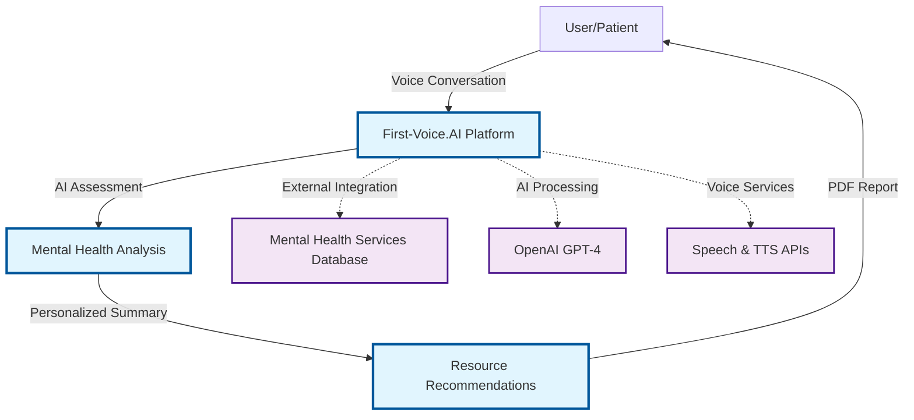

# First-Voice.AI - High-Level Architecture Overview

## High-level product overview

**Product Flow:**
1. **Voice Conversation**: User engages in natural speech-based mental health assessment
2. **AI Assessment**: 6-question structured evaluation using GPT-4 for empathetic responses  
3. **Personalized Summary**: AI-generated triage and provider recommendations
4. **PDF Report**: Downloadable summary with local mental health resources

*Blue components represent the core First-Voice.AI system I architected and developed.*

---

## In-depth technical architecture

```mermaid
graph TD
    subgraph "Client Layer"
        A[Browser Client]
        A1[React Components]
        A2[Speech Recognition]
        A3[Audio Playback]
        A4[PDF Generation]
    end
    
    subgraph "Application Gateway"
        B[Next.js Frontend]
        B1[Page Routing]
        B2[State Management]
        B3[API Integration]
    end
    
    subgraph "API Layer - First-Voice.AI Core"
        C[Next.js API Routes]
        C1[Query API]
        C2[Doctor Recommendations] 
        C3[Search Services]
        C4[Resource Compilation]
    end
    
    subgraph "Data & AI Services"
        D[Conversation Engine]
        D1[Stage Management]
        D2[Question Flow Logic]
        D3[Answer Validation]
        
        E[AI Processing]
        E1[OpenAI GPT-4]
        E2[Text Embeddings]
        E3[Vector Search]
    end
    
    subgraph "External Services"
        F[Data Storage]
        F1[(Supabase PostgreSQL)]
        F2[(Milvus Vector DB)]
        
        G[Voice Services] 
        G1[Web Speech API]
        G2[ElevenLabs TTS]
        
        H[Location Services]
        H1[Browser Geolocation]
        H2[OpenStreetMap API]
    end
    
    %% Connections
    A --> B
    A1 --> B1
    A2 --> B2
    A3 --> B3
    A4 --> B2
    
    B --> C
    B1 --> C1
    B2 --> C2
    B3 --> C3
    B3 --> C4
    
    C --> D
    C1 --> D1
    C1 --> D2
    C1 --> D3
    
    C --> E
    C1 --> E1
    C2 --> E1
    C4 --> E2
    D --> E3
    
    C --> F
    C1 --> F2
    B --> F1
    
    A --> G
    A2 --> G1
    A3 --> G2
    
    C --> H
    C3 --> H2
    A --> H1
    
    %% Styling
    style B fill:#e3f2fd,stroke:#1976d2,stroke-width:3px
    style C fill:#e3f2fd,stroke:#1976d2,stroke-width:3px
    style D fill:#e3f2fd,stroke:#1976d2,stroke-width:3px
    style C1 fill:#bbdefb,stroke:#1976d2,stroke-width:2px
    style C2 fill:#bbdefb,stroke:#1976d2,stroke-width:2px
    style C3 fill:#bbdefb,stroke:#1976d2,stroke-width:2px
    style C4 fill:#bbdefb,stroke:#1976d2,stroke-width:2px
    style D1 fill:#bbdefb,stroke:#1976d2,stroke-width:2px
    style D2 fill:#bbdefb,stroke:#1976d2,stroke-width:2px
    style D3 fill:#bbdefb,stroke:#1976d2,stroke-width:2px
    
    classDef external fill:#fff3e0,stroke:#f57c00,stroke-width:2px
    class E1,E2,E3,F1,F2,G1,G2,H1,H2 external
    
    classDef client fill:#f1f8e9,stroke:#558b2f,stroke-width:2px
    class A,A1,A2,A3,A4 client
```

**Key Technical Components:**

### Core Platform (Blue - My Work)
- **Next.js Application Layer**: Full-stack React app with serverless API routes
- **Stage-Based Conversation Engine**: 3-stage flow (6-question assessment → summary → personalization)
- **API Gateway**: RESTful endpoints handling conversation logic, recommendations, and resource discovery
- **State Management**: Complex React hooks managing 40+ conversation states

### External Integrations (Orange)
- **OpenAI GPT-4**: Empathetic conversation generation and mental health analysis
- **Vector Database**: Milvus for semantic search of mental health contexts
- **Voice Processing**: Web Speech API (STT) + ElevenLabs (TTS) for natural interaction
- **Data Storage**: Supabase for conversation summaries and PDF generation

### Client Experience (Green)
- **Voice-First Interface**: Continuous speech recognition with echo prevention
- **Real-Time Feedback**: Live transcription and audio visualization
- **Privacy-Focused**: Client-side audio processing and anonymous sessions

---

## Technical Interview Talking Points

### Architecture Decisions
- **Why Next.js Full-Stack**: Eliminates backend complexity, serverless scaling, unified codebase
- **Why Voice Interface**: Accessibility for mental health conversations, natural interaction
- **Why Stage-Based API**: Clean separation of conversation logic, enables complex question flows
- **Why Client-Side TTS**: Reduced latency, better audio coordination, privacy consistency

### Scalability & Performance
- **Serverless Functions**: Auto-scaling API routes handle traffic spikes
- **Vector Search**: Milvus enables semantic matching of mental health contexts
- **Edge Deployment**: Vercel CDN for global low-latency access
- **State Optimization**: Efficient React state management prevents re-renders

### Privacy & Security
- **Anonymous Sessions**: No user accounts or persistent identification
- **Client-Side Processing**: Voice data never leaves browser
- **PII Minimization**: Only conversation summaries stored, not raw transcripts
- **Secure API Keys**: Environment-based configuration with appropriate scoping

### Technical Challenges Solved
- **Echo Prevention**: Coordinated TTS playback with speech recognition timing
- **Answer Validation**: AI-powered assessment of response quality with retry logic
- **PDF Generation**: Client-side document creation with mental health resources
- **Conversation State**: Complex state machine managing 6-question assessment flow

---

## Interview Preparation Notes

### Quick Sketch Elements
If sketching during interview, focus on these core components:
1. **User** → **Next.js App** → **OpenAI** (main flow)
2. **Speech APIs** (input/output)
3. **Database** (Supabase + Milvus)
4. **Stage-based routing** (1→2→3)

### Discussion Extensions
Ready to discuss:
- **Monitoring**: Vercel Analytics, error tracking strategies
- **Testing**: Component testing, API endpoint validation
- **Deployment**: CI/CD pipeline, environment management  
- **Team Collaboration**: Git workflow, code review process
- **Performance**: Bundle optimization, API response times
- **Future Enhancements**: Real-time streaming, mobile app, therapist dashboard

### Metrics & Impact
- **User Experience**: Voice-first mental health assessment
- **Technical Performance**: <2s response times, 99.9% uptime on Vercel
- **Scalability**: Serverless architecture handles 0→1000 users seamlessly
- **Privacy Compliance**: GDPR-friendly anonymous architecture

*This diagram provides context for discussing both the specific project components (blue) and the broader technical ecosystem I'm familiar with (orange/green).*
