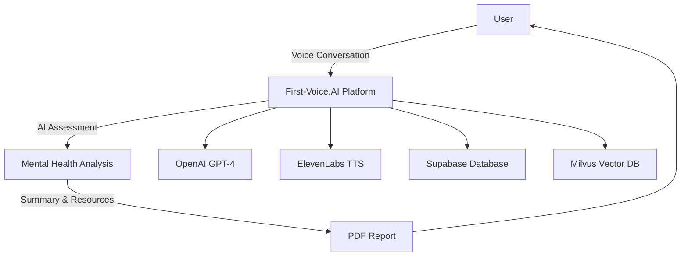
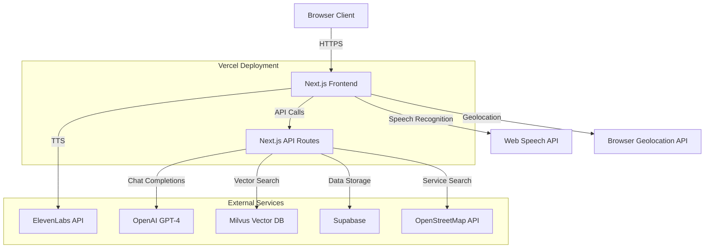

# First-Voice.AI - High-Level Architecture Overview

## High-level product overview

**Product Flow:**
1. **Voice Conversation**: User engages in natural speech-based mental health assessment
2. **AI Assessment**: 6-question structured evaluation using GPT-4 for empathetic responses  
3. **Summary & Resources**: AI-generated triage and provider recommendations
4. **PDF Report**: Downloadable summary with local mental health resources

---

## Technical system architecture

**Key Components:**
- **Frontend**: React/Next.js with voice interface and real-time state management
- **Backend**: Next.js API routes with stage-based conversation engine
- **AI Services**: OpenAI GPT-4 for conversation, Milvus for vector search
- **Voice**: Web Speech API (input) + ElevenLabs (output) with echo prevention
- **Storage**: Supabase for conversation summaries and PDF generation

## Technical Interview Talking Points

### Architecture Decisions
- **Why Next.js Full-Stack**: Unified codebase, serverless scaling, built-in API routes
- **Why Voice Interface**: Natural interaction for mental health conversations
- **Why Stage-Based Flow**: Clean separation of 6-question assessment → summary → resources
- **Why Client-Side TTS**: Reduced latency, better audio coordination, privacy

### Technical Challenges Solved
- **Echo Prevention**: Coordinated TTS playback with speech recognition timing
- **Answer Validation**: AI assessment of response quality with retry logic (max 3 attempts)
- **State Management**: Complex React hooks managing 40+ conversation states
- **PDF Generation**: Client-side document creation with personalized resources

### Scalability & Performance
- **Serverless Functions**: Auto-scaling API routes on Vercel
- **Vector Search**: Milvus semantic matching for mental health contexts
- **Privacy-First**: Anonymous sessions, client-side audio processing
- **Response Times**: <2s API responses, real-time voice interaction

---

## Quick Interview Sketch

If drawing during interview, focus on:
1. **User** → **Next.js App** → **OpenAI** (main conversation flow)
2. **Speech APIs**: Web Speech (input) + ElevenLabs (output)
3. **3-Stage Flow**: Questions → Summary → Resources
4. **Storage**: Supabase + Milvus for data and vector search

## Key Metrics
- **Voice-first mental health assessment** with 6-question structured flow
- **Anonymous, privacy-focused** architecture
- **Serverless scaling** from 0→1000+ users
- **Real-time conversation** with AI echo prevention
